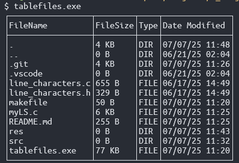

# List-Table-Files ~ts 
A CLI tool that displays directory contents of the current working directory into a neat little table. Building this project got me feeling like that one gif of Tony Stark hammering the scrap metal on the anvil. There something so rewarding about making your own tools from scratch.


## Features
- Table displays the Filename, Filesize, Type (File or Directory), and the Date last Modified (Month/Day/Year Time).
- The table's "FileName" columns' length is dynamic with the length of the longest filename in the directory.
- FileSize column displays file size in Bytes (B), Kilobytes (KB)Megabytes (MB), and Gigabytes (GB).
- Uses unicode escape codes to draw the table.

## Demo



## Usage
```
$ tablefiles.exe
```

## Build from Source
```
$ make
```